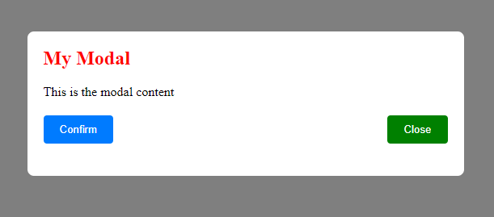

# my-modal-souleymane7800

"Modal React pour l'application HRnet de WealthHealth : Un composant React réutilisable pour implémenter des boîtes de dialogue modales dans l'application HRnet. Ce composant a été converti à partir d'un plugin jQuery existant et est conçu pour améliorer la convivialité et l'expérience utilisateur de l'application. Il suit les meilleures pratiques de la programmation fonctionnelle et est testé pour garantir la stabilité et les performances. Documenté avec soin pour faciliter l'intégration et la maintenance futures."

    



## Installation

You can install the package using npm:

```bash
npm install --save my-modal-souleymane7800
```

## Modal component

### Description

my-modal-souleymane7800 is a flexible and customizable React modal component built with TypeScript and Vite...

### Props

| Prop         | Type                | Required | Description                                      |
| ------------ | ------------------- | -------- | ------------------------------------------------ |
| isOpen       | boolean             | Yes      | Controls whether the modal is open or closed     |
| onClose      | () => void          | Yes      | Function to call when the modal should be closed |
| message      | string              | Yes      | The main message to display in the modal         |
| label        | string              | Yes      | The title or label for the modal                 |
| confirm      | string              | Yes      | Text for the confirmation button                 |
| close        | string              | Yes      | Text for the close button                        |
| overlayStyle | React.CSSProperties | No       | Custom styles for the modal overlay              |
| contentStyle | React.CSSProperties | No       | Custom styles for the modal content container    |
| headerStyle  | React.CSSProperties | No       | Custom styles for the modal header               |
| bodyStyle    | React.CSSProperties | No       | Custom styles for the modal body                 |
| closeStyle   | React.CSSProperties | No       | Custom styles for the close button               |
| children     | React.ReactNode     | No       | Additional content to render inside the modal    |

### Examples

```bash
 <Modal
    isOpen={isModalOpen}
    onClose={closeModal}
    label='My Modal'
    message='This is the modal content'
    confirm='Confirm'
    close='Close'
    overlayStyle={{ 'your style' }}
    contentStyle={{ 'your style' }}
    bodyStyle={{ 'your style' }}
  />
```

### Usage

```bash
  import React, { useState } from 'react';
  import { Modal } from 'my-modal-souleymane7800';
  import styled from 'styled-components';

  function Example() {
    const [isModalOpen, setIsModalOpen] = useState(false);

    return (
      <div>
        <button onClick={() => setIsModalOpen(true)}>
          Open Modal
        </button>
        <Modal
          isOpen={isModalOpen}
          onClose={() => setIsModalOpen(false)}
          label='My Modal'
          message='This is the modal content'
          confirm='Confirm'
          close='Close'
          overlayStyle={{ 'your style' }}
          contentStyle={{ 'your style' }}
          bodyStyle={{ 'your style' }}
        />
        <button onClick={onClose}>{confirm}</button>
        <button style={closeStyle} onClick={onClose}>
          {close}
        </button>
      </div>
    );
  }

export default Example;
```

## Peer Dependencies

The my-modal-souleymane7800 component has the following peer dependencies:

```bash
  "peerDependencies": {
    "react": "^18.3.1",
    "react-dom": "^18.3.1",
    "styled-components": "^6.1.12"
  }
```

## License

MIT © souleymane7800
